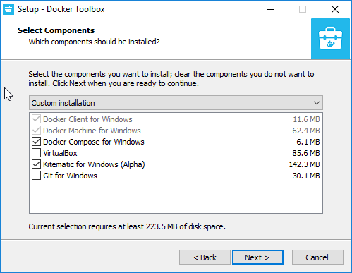
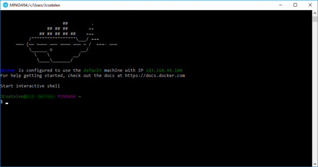
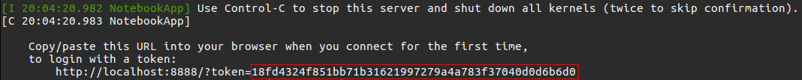
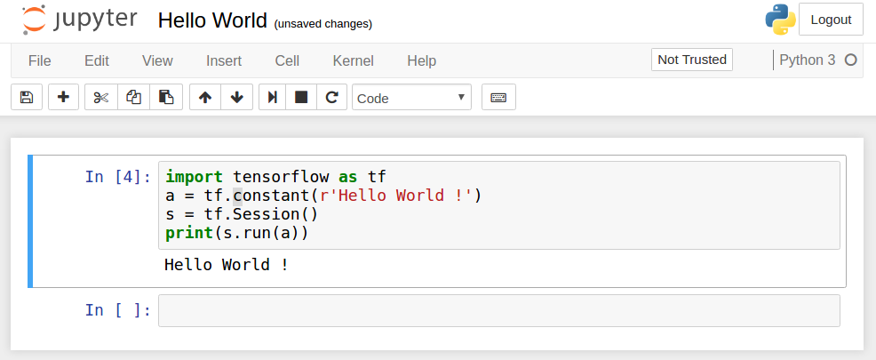
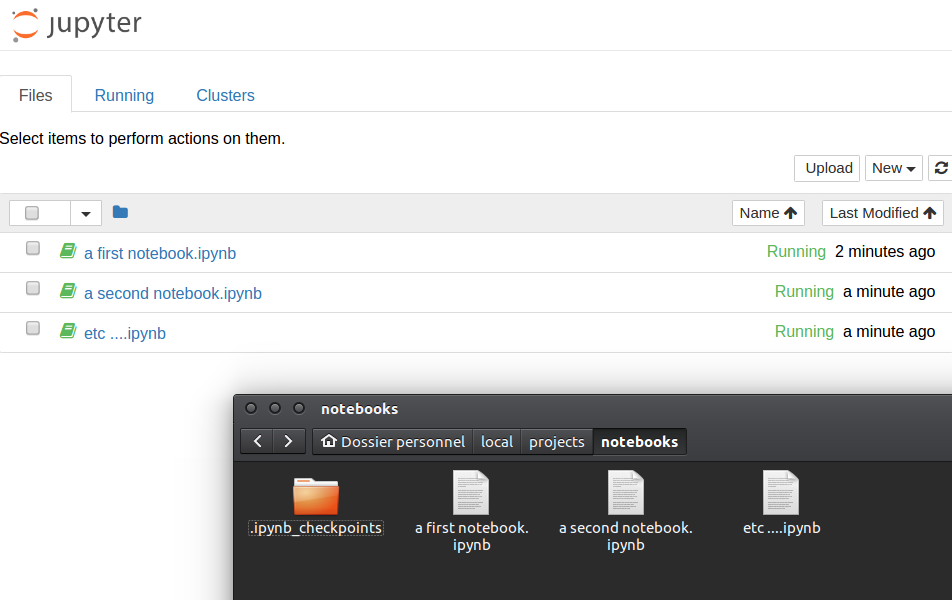
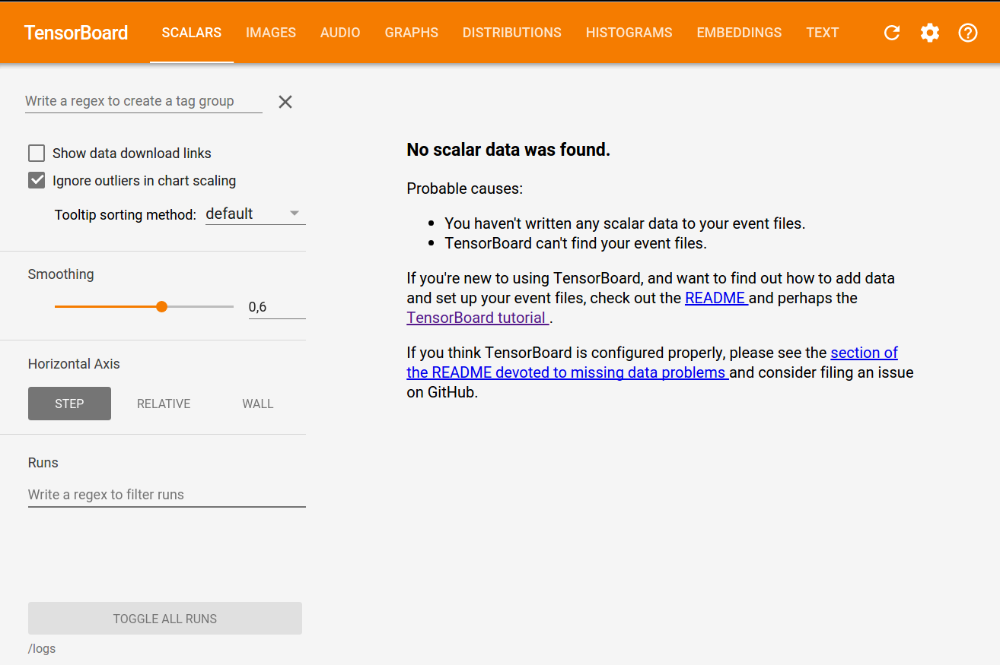

# tensorflow-python3-jupyter

# Note this fork GIT modify the parent GIT with the followings
* Launch the **Tensorboard Web GUI server** (at port 26006 as default)
* Launch the **Tensorflow-Python3-Jupyter server** (at port 28888 as default)
* Added Python3 Tensorflow examples from the forked GIT, "git@github.com:DrSnowbird/TensorFlow-Examples.git (forked from its parent aymericdamien/TensorFlow-Examples" (I corrected some of the syntax for print to be Python3 - but not completed done for all notebook yet)

# Run
Two ways to run:
```
./run.sh
```
or
```
docker-compose up
```

## What is it ?

This project helps one to easily benefit from a fully packaged machine learning and deep learning environment.  This has been especially made for teaching purposes but it can simply be used to begin in Machine Learning: 

## Why you may need this ?

The three main reasons why you may need this package are: 
1. Installing a machine learning environment can generally be tricky for beginners while doing it with this project is **very easy**
2. When you install the included libraries on a system, it can impact the general installation of the system, here **everything is packaged in a docker container** and nothing interfere with in your system. For instance, the container embed a Python installation and even if you already have Python installed on your system, only the embedded version will be used. 
3. As you will see below, the installation process is **quick** and holds in **a few command lines** 

## What does it contain ? 

* [Jupyter Notebook](https://jupyter.org/)
* [TensorFlow](https://www.tensorflow.org/)
* [scikit-learn](http://scikit-learn.org/stable/)
* [pandas](http://pandas.pydata.org/)
* [matplotlib](https://matplotlib.org/)
* [numpy](http://www.numpy.org/)
* [scipy](https://www.scipy.org/)
* [Pillow](https://pillow.readthedocs.io/en/4.1.x/)
* [Python 2 and 3](https://www.python.org/)

Note: the jupyter notebooks are only based on Python 3 kernels but Python 2 is available anywhere else.

## How to install it ?

### On Windows (or Mac, but I am not able to test on Mac)

1. Download [DockerToolbox](https://www.docker.com/products/docker-toolbox)

2. Run the installer 

3. At the step "Select Components", uncheck the elements already installed on your system (ex: VirtualBox)

	 
	
4.  Run the *Docker Quickstart Terminal* application and use it as your shell. If the application request for permissions about VirtualBox you have to accept all of them.

	 
	
5. In the terminal, type the following command to download the machine learning environment

	```
	$ docker pull dash00/tensorflow-python3-jupyter
	```

### On Linux

1. Open a terminal

1. Install Docker 

	```
	$ sudo apt-get install docker.io
	```
	
2. Download the machine learning environment

	```
	$ docker pull dash00/tensorflow-python3-jupyter
	```

## How to use it ?

Once Docker has been installed and the package has been downloaded, one can simply use the following commands from a terminal (use Docker Quickstart Terminal on Windows). 

1. Let `<CONTAINER_IP>` be the IP address of the container
	- on Windows: note the IP address which is printed in the terminal at the top (here: 192.168.99.100 on the picture above)
	- on Linux: you will use 'localhost' or 127.0.0.1
	
2. **Basic usage: Hello world!** 

	Use the following command to start a basic container
	
	```
	$ docker run -it -p 8888:8888 dash00/tensorflow-python3-jupyter
	```
	
	The options `-it` and `-p` allow respectively to run an interactive container (attached to the terminal) and to expose the port 8888 of the container (this port is used by the jupyter web service). 
	
	By default, a token authentification is enabled. Therefore, the first time you use the container you will need to copy the token from the terminal to log in the Jupyter Notebook (see next subsection to disable authentification). 
	
	 
	
	Then, you can access your notebooks from your web browser at this URL (paste the token in the password field) : 
	`http://<CONTAINER_IP>:8888/`
	
	Open the hello world notebook, run it and voila !
	
	 
	

3. **Disable token authentification**

	Even if it is not recommended for security reasons, the token authentification can be disabled. To remove it, you will have to explicitely call the `run_jupyter.sh` script  with the option `--NotebookApp.token` set to empty: 
	
	```
	$ docker run -it -p 8888:8888 dash00/tensorflow-python3-jupyter /run_jupyter.sh --allow-root --NotebookApp.token=''
	``` 

4. **Use a persistent folder**

	If you want to work in persistent folder (independent of the container, which will not be removed at the end of the container execution) use the  `-v` option as follow:
	
	 ``` 
	$ docker run -it -p 8888:8888 -v /$(pwd)/notebooks:/notebooks dash00/tensorflow-python3-jupyter
	```
	
	You can change `/$(pwd)/notebooks` by any path on the local system. If the folder does not exist, it will be created. This option maps the given local folder with the folder of the notebooks on Jupyter. This folder should contain all your notebooks indeed. 

5. **Now, let's use Jupyter Notebook and Tensorboard in the same time** 

	a. Create a container 'notebooks' to run Jupyter Notebook (port 8888)

	```
	$ docker run  --name notebooks -d -v /$(pwd)/notebooks:/notebooks -v /$(pwd)/logs:/logs -p 8888:8888 dash00/tensorflow-python3-jupyter /run_jupyter.sh --allow-root --NotebookApp.token=''
	```
	 
	The option `-d` detaches the container, i.e. it makes it run in background. Jupyter is still available on `http://<CONTAINER_IP>:8888/`.
	
	<kbd></kbd>
	
	b. Create a container 'board' to run Tensorboard (port 6006):
	
	```
	$ docker run  --name board -d -v /$(pwd)/logs:/logs -p 6006:6006 dash00/tensorflow-python3-jupyter tensorboard --logdir /logs
	```
	
	Tensorboard will be available on `http://<CONTAINER_IP>:6006/`.
	
	 
	 
## How to build my own docker image ?

Get the files of the GitHub repository [tensorflow-python3-jupyter](https://github.com/dash00/tensorflow-python3-jupyter) by downloading the ZIP file or by cloning the repository:

```
git clone https://github.com/dash00/tensorflow-python3-jupyter.git
```

Open a terminal and set the current working directory to the newly created folder with the project files. 

```
cd tensorflow-python3-jupyter
docker build .
```


